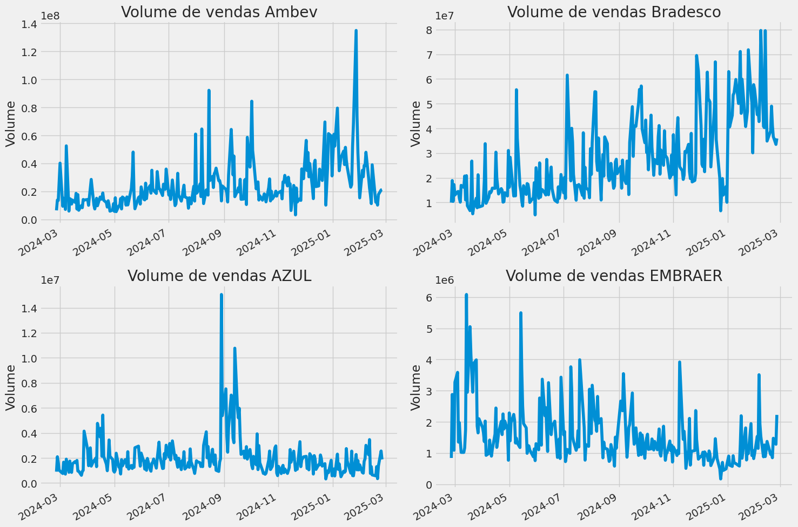
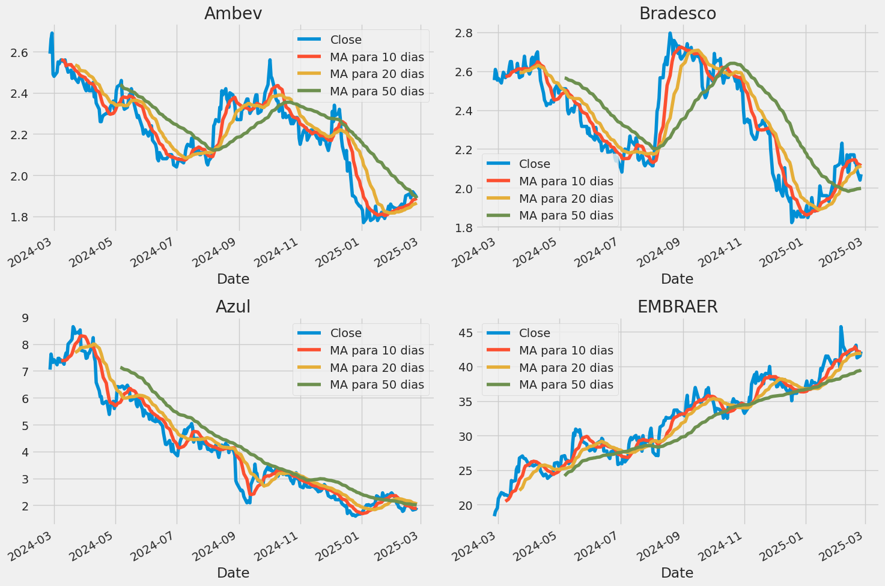
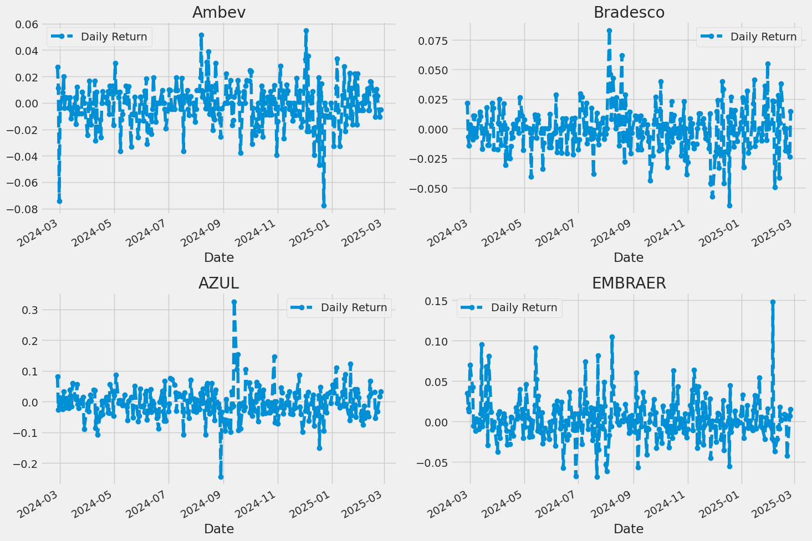
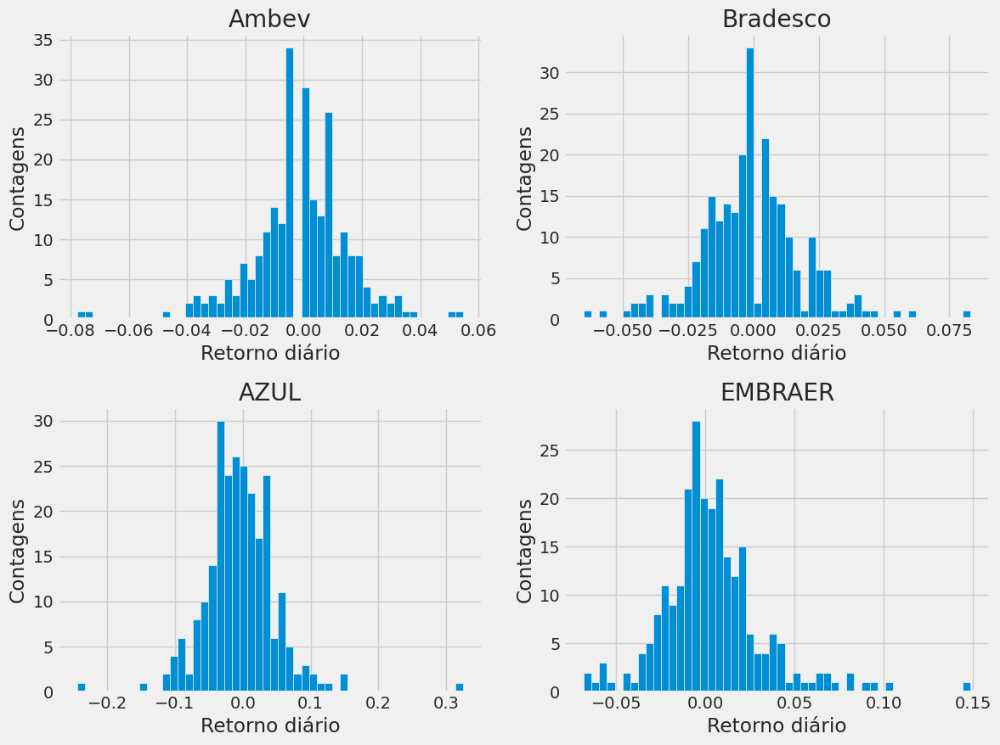
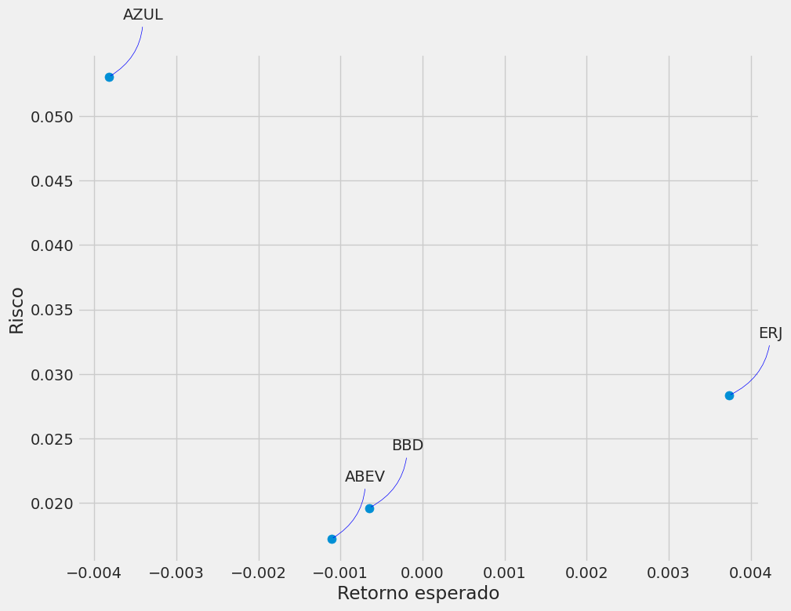

# Análise e predição de valores de ações
<div style="width: 1000px; height: 500px;">
    
</div>

## Conceito do projeto
Este projeto foi desenvolvido com o intuito de expor conhecimentos de aprendizado de máquina na prática para fazer análise e predição de valores de ações da bolsa de valores. Primeiro fazemos exploração dos dados usando gráficos para visualizar a variação dos valores, média móvel, risco ao investir e descobrir a correlação entre as ações analisadas, para assim fazer o pré-processamento dos dados para treinar o modelo [Long Short-Term Memory layer (LSTM)](https://keras.io/api/layers/recurrent_layers/lstm/) para prever seus possíveis valores ao longo do tempo.

## Pré-requisitos e recursos utilizados
- Linguagem Python
- [Jupyter Notebook](https://jupyter.org/)
- [Docker](https://www.docker.com/)
- VScode com a extensão [Dev Container](https://code.visualstudio.com/docs/devcontainers/containers)

## Instalação
1. Clone o repositório na sua máquina e abra no VSCode:
   ```
   git clone <URL_DO_REPOSITORIO>
   ```
2. Reabra o projeto no Dev Container quando solicitado pelo pop-up do VSCode.
3. O Dev Container pode pedir pra instalar python ou extensões do Jupyter/Anaconda

## Execução
1. Abra o notebook `main.ipynb`.
2. Execute as células para rodar o código.

## Passo a passo
Para realizar esse projeto seguir o seguintes passos:

1. Pesquisei sobre o assunto de ações e procurei soluções existentes
2. A melhor solução que encontrei foi o notebook [📊Stock Market Analysis 📈 + Prediction using LSTM](https://www.kaggle.com/code/faressayah/stock-market-analysis-prediction-using-lstm) no Kaggle que é uma excelente plataforma para aprender ciências de dados, IA e Machine leaning com os notebooks feitos pela comunidade e também nele é possível participar de competições
3. Estudei o código e me aprofundei nos conceitos de ações e no modelo de Redes Neurais Long Short Term Memory (LSTM), links de artigos que li e vídeo podem ser encontrados nas referências.
4. Atualizei o código para funcionar com a versão mais recente do Yahoo Finance
5. Traduzir o notebook pra português e modifiquei o código para usar ações de empresas brasileiras conhecidas  
[Ambev (ABEV)](https://finance.yahoo.com/quote/ABEV/), [Bradesco (BBD)](https://finance.yahoo.com/quote/BBD/), [AZUL (AZUL)](https://finance.yahoo.com/quote/AZUL/) e [EMBRAER(ERJ)](https://finance.yahoo.com/quote/ERJ/)


## Análise das Ações

Iremos explorar dados do mercado de algumas ações populares do Brasil (Ambev, Bradesco, Azul e EMBRAER). Utilizando Yahoo Finance para obter informações sobre ações e visualizaremos diferentes aspectos desses dados com Seaborn e Matplotlib. Também analisaremos algumas formas de avaliar o risco de uma ação com base em seu histórico de desempenho. Além disso, faremos previsões de preços futuros da Ambev utilizando o método Long Short-Term Memory (LSTM).  

### 1. Como o preço da ação variou ao longo do tempo?
Nesta seção, abordaremos como lidar com a solicitação de informações sobre ações com pandas e como analisar atributos básicos de uma ação.


#### Preço de Fechamento
O preço de fechamento é o último preço pelo qual a ação é negociada durante o dia de negociação regular. O preço de fechamento de uma ação é o benchmark padrão usado por investidores para rastrear seu desempenho ao longo do tempo.


#### Volume de Vendas
Volume é a quantidade de um ativo ou título que muda de mãos ao longo de um período de tempo, geralmente ao longo de um dia. Por exemplo, o volume de negociação de ações se referiria ao número de ações de título negociadas entre sua abertura e fechamento diários. O volume de negociação e as mudanças no volume ao longo do tempo são entradas importantes para traders técnicos.



## 2. Qual foi o retorno diário médio da ação?

A média móvel (MA) é uma ferramenta simples de análise técnica que suaviza dados de preço criando um preço médio constantemente atualizado. A média é tomada em um período de tempo específico, como 10 dias, 20 minutos, 30 semanas ou qualquer período de tempo que o trader escolher. Por exemplo, se a média móvel de 10 dias cruzar acima da de 50 dias, pode ser um sinal de alta, e vice-versa.



Vemos no gráfico que os melhores valores para medir a média móvel são 10 e 20 dias porque ainda capturamos tendências nos dados sem ruído.

### 3. Qual foi a média móvel das diferentes ações?  

Agora que fizemos algumas análises de base, vamos em frente e mergulhar um pouco mais fundo. Agora vamos analisar o risco da ação. Para fazer isso, precisaremos dar uma olhada mais de perto nas mudanças diárias da ação, e não apenas em seu valor absoluto. 



Ambev: Os retornos diários variam entre -0.08 e 0.06, com alguns picos e quedas ao longo do tempo.

Azul: Apresenta retornos mais voláteis, com variações entre -0.2 e 0.3.

Bradesco: Retornos mais estáveis, variando entre -0.05 e 0.075.


Ótimo, agora vamos dar uma olhada geral no retorno médio diário usando um histograma.



Ambev: A maioria dos retornos diários está concentrada em torno de 0.00 a 0.02, indicando uma volatilidade relativamente baixa.

Azul e Embraer: Ambas mostram uma distribuição mais ampla, com retornos variando mais significativamente, o que pode indicar maior volatilidade.

Bradesco: A distribuição de retornos parece mais concentrada, sugerindo menor volatilidade comparada às outras empresas.

### 4. Qual foi a correlação entre as ações analisadas?  

Correlação é uma estatística que mede o grau em que duas variáveis ​​se movem em relação uma à outra, que tem um valor que deve estar entre -1,0 e +1,0. A correlação mede a associação, mas não mostra se x causa y ou vice-versa — ou se a associação é causada por um terceiro fator[1].

Segue gráfico de correlação, para obter valores numéricos reais para a correlação entre os valores de retorno diário das ações.

- Correlação entre as ações


vemos aqui numericamente e visualmente que a Bradesco e a Ambev tiveram a correlação mais forte de retorno diário de ações.

### 5. Quanto valor está em risco ao investir em uma ação específica? 

Há muitas maneiras de quantificar o risco. Uma das maneiras mais básicas de usar as informações que coletamos sobre retornos percentuais diários é comparar o retorno esperado com o desvio padrão dos retornos diários.



podemos ver que o AZUL possui um maior risco.

### 6. Prevendo o preço de fechamento da Ambev S.A. usando LSTM

Treinamos o modelo LSTM com as ações da Ambev e visualizando os resultados gráficamente, podemos ver que o modelo conseguiu prever aproximandamente os valores válidos das ações.


## Bugs/problemas conhecidos
- O modelo LSTM pode não prever com precisão os valores das ações devido à natureza volátil do mercado de ações.

## Autor
* Renan Oliveira de Barros Lima ([GitHub](https://github.com/Renan04lima))

## Referências e links úteis para se aprofundar
- [Arquitetura de Redes Neurais Long Short Term Memory (LSTM)](https://www.deeplearningbook.com.br/arquitetura-de-redes-neurais-long-short-term-memory/)
- Vídeo [Long Short-Term Memory (LSTM), claramente explicado](https://www.youtube.com/watch?v=YCzL96nL7j0)
- Vídeos sobre cuidados ao usar LSTM ao prever valores de ações:
  1. [Predicting Stock Prices with LSTMs: One Mistake Everyone Makes (Episode 16)](https://www.youtube.com/watch?v=Vfx1L2jh2Ng)
  2. [Stock Price Prediction with Machine Learning Mistakes: Prices As Inputs (Episode 20)](https://www.youtube.com/watch?v=aIklUbW0UWI)
  3. [Common Mistakes in Stock Price Prediction: Prices As Targets (Episode 21)](https://www.youtube.com/watch?v=xOcyV5Q2G5I)
- Notebook usado como Base [📊Stock Market Analysis 📈 + Prediction using LSTM](https://www.kaggle.com/code/faressayah/stock-market-analysis-prediction-using-lstm)
- [Biblioteca do Yahoo finance para obter dados financeiros](https://aroussi.com/post/python-yahoo-finance)


