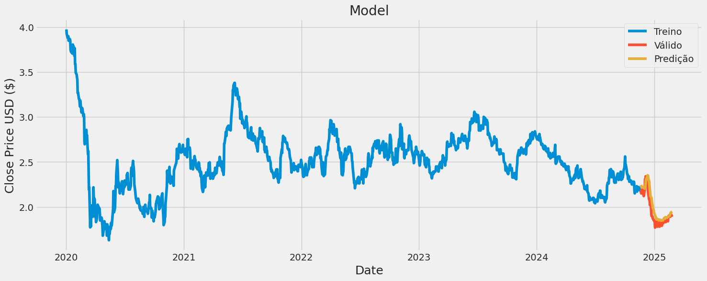
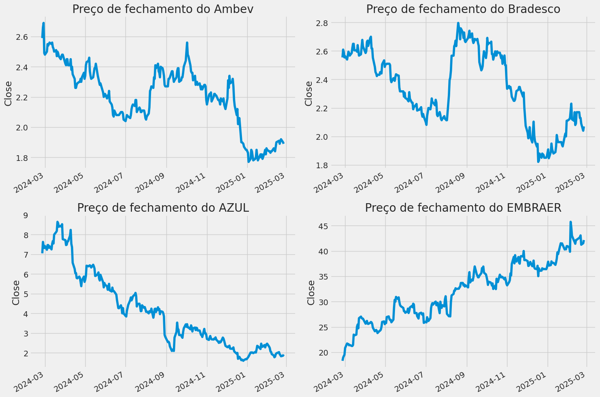
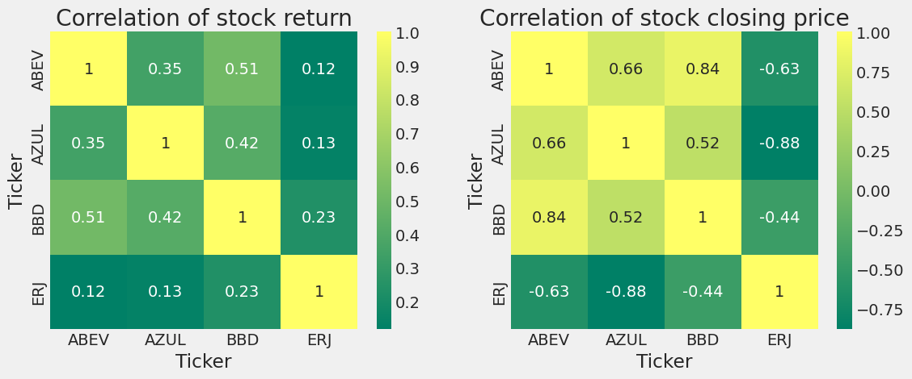

# Análise e predição de valores de ações
<div style="width: 1000px; height: 500px;">
    
</div>

## Conceito do projeto
Este projeto foi desenvolvido com o intuito de expor conhecimentos de aprendizado de máquina na prática para fazer análise e predição de valores de ações da bolsa de valores. Primeiro fazemos exploração dos dados usando gráficos para visualizar a variação dos valores, média móvel, risco ao investir e descobrir a correlação entre as ações analisadas, para assim fazer o pré-processamento dos dados para treinar o modelo [Long Short-Term Memory layer (LSTM)](https://keras.io/api/layers/recurrent_layers/lstm/) para prever seus possíveis valores ao longo do tempo.

## Pré-requisitos e recursos utilizados
- Linguagem Python
- [Jupyter Notebook](https://jupyter.org/)
- [Docker](https://www.docker.com/)
- VScode com a extensão [Dev Container](https://code.visualstudio.com/docs/devcontainers/containers)

## Passo a passo
Para realizar esse projeto seguir o seguintes passos:

1. Pesquisei sobre o assunto de ações e procurei soluções existentes
2. A melhor solução que encontrei foi o notebook [📊Stock Market Analysis 📈 + Prediction using LSTM](https://www.kaggle.com/code/faressayah/stock-market-analysis-prediction-using-lstm) no Kaggle que é uma excelente plataforma para aprender ciências de dados, IA e Machine leaning com os notebooks feitos pela comunidade e também nele é possível participar de compertições
3. Estudei o código e me aprofundei nos conceitos de ações e no modelo de Redes Neurais Long Short Term Memory (LSTM), links de artigos que li e vídeo podem ser encontrados nas referências.
4. Atualizei o código para funcionar com a versão mais recente do Yahoo Finance
5. Traduzir o notebook pra português e modifiquei o código para usar ações de empresas brasileiras conhecidas  
[Ambev (ABEV)](https://finance.yahoo.com/quote/ABEV/), [Bradesco (BBD)](https://finance.yahoo.com/quote/BBD/), [AZUL (AZUL)](https://finance.yahoo.com/quote/AZUL/) e [EMBRAER(ERJ)](https://finance.yahoo.com/quote/ERJ/)
6. Após esses ajustes fiz o treino do modelo LSTM com as ações da Ambev e visualizando os resultados gráficamente, podemos ver que o modelo conseguiu prever aproximandamente os valores válidos das ações


## Instalação
1. Clone o repositório na sua máquina e abra no VSCode:
   ```
   git clone <URL_DO_REPOSITORIO>
   ```
2. Reabra o projeto no Dev Container quando solicitado pelo pop-up do VSCode.
3. O Dev Container pode pedir pra instalar python ou extensões do Jupyter/Anaconda

## Execução
1. Abra o notebook `main.ipynb`.
2. Execute as células para rodar o código.

## Bugs/problemas conhecidos
- O modelo LSTM pode não prever com precisão os valores das ações devido à natureza volátil do mercado de ações.

## Autor
* Renan Oliveira de Barros Lima ([GitHub](https://github.com/Renan04lima))

## Referências e links úteis para se aprofundar
- [Arquitetura de Redes Neurais Long Short Term Memory (LSTM)](https://www.deeplearningbook.com.br/arquitetura-de-redes-neurais-long-short-term-memory/)
- Vídeo [Long Short-Term Memory (LSTM), claramente explicado](https://www.youtube.com/watch?v=YCzL96nL7j0)
- Vídeos sobre cuidados ao usar LSTM ao prever valores de ações:
  1. [Predicting Stock Prices with LSTMs: One Mistake Everyone Makes (Episode 16)](https://www.youtube.com/watch?v=Vfx1L2jh2Ng)
  2. [Stock Price Prediction with Machine Learning Mistakes: Prices As Inputs (Episode 20)](https://www.youtube.com/watch?v=aIklUbW0UWI)
  3. [Common Mistakes in Stock Price Prediction: Prices As Targets (Episode 21)](https://www.youtube.com/watch?v=xOcyV5Q2G5I)
- Notebook usado como Base [📊Stock Market Analysis 📈 + Prediction using LSTM](https://www.kaggle.com/code/faressayah/stock-market-analysis-prediction-using-lstm)
- [Biblioteca do Yahoo finance para obter dados financeiros](https://aroussi.com/post/python-yahoo-finance)

## Imagens/screenshots

- Preço de Fechamento

- Volumes de vendas

- Correlação entre as ações

